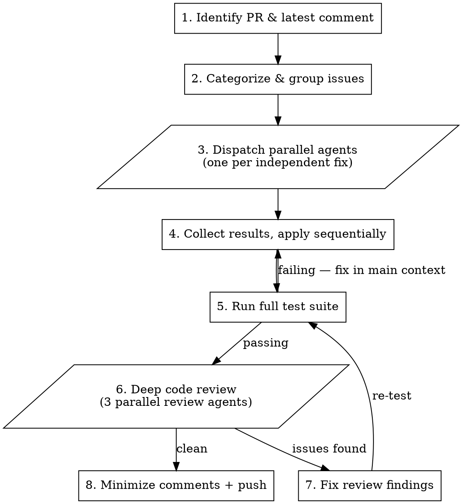

# Resolve PR Review

Address the latest PR review comment with atomic commits, push fixes, and mark previous comments as outdated.

## Workflow



## Step 1: Identify PR and Latest Comment

```bash
# Get PR for current branch
gh pr view --json number,title,url,headRefName

# Get all issue comments with node_ids (needed for GraphQL minimization)
gh api repos/{owner}/{repo}/issues/{pr_number}/comments \
  --jq '.[] | {id, node_id, body: (.body | split("\n")[0][:100])}'

# The latest comment is the one to address
gh pr view {number} --json comments --jq '.comments[-1].body'
```

**Important:** Use `gh api repos/.../issues/.../comments` (not `gh api repos/.../pulls/.../comments`) — issue comments are top-level PR comments. Pull comments are inline review comments on specific lines.

## Step 2: Categorize and Group Issues

Read the latest review and classify each issue:

| Category | Action |
|----------|--------|
| Bug / incorrect behavior | Fix with code change + test |
| Misleading docs/JSDoc | Fix the wording |
| Latent inconsistency | Fix the root cause |
| Missing validation | Add validation + test |
| Lockfile / version mismatch | Regenerate with `npm install --package-lock-only` |
| Awareness-only observation | Skip — no code change needed |
| PR description nit | Update via `gh pr edit` if needed |

**Determine independence:** Issues that touch different files are independent. Issues touching the same file or where one fix depends on another's output are dependent and must be sequential.

## Step 3: Fix Issues in Parallel

**Dispatch one Agent per independent fix** using `isolation: "worktree"`. Each agent works in its own git worktree so there are no conflicts.

Each agent prompt must include:
- The specific review issue to fix (quote it verbatim)
- The file paths involved
- Whether to add/update tests
- Instruction to commit with this message format:

```
fix: <what changed> — <why>

<Optional body explaining the before/after behavior>

Co-Authored-By: Claude Opus 4.6 (1M context) <noreply@anthropic.com>
```

**Example dispatch pattern:**

```
Agent 1 (worktree): "Fix clearCache JSDoc — change 'cancel' to 'complete but not populate cache' in src/features/client.ts"
Agent 2 (worktree): "Sort cleaned brand IDs in normalizeBrandIds for consistent API URLs in src/features/client.ts"
Agent 3 (worktree): "Add boolean validation in validateResponse + test in test/features-client.test.ts"
Agent 4 (worktree): "Run npm install --package-lock-only to sync package-lock.json version"
```

**Dependent fixes** (same file, or fix B relies on fix A) must go to the **same agent** or be applied sequentially in the main context.

## Step 4: Collect and Apply Results

Once all agents complete:
1. Cherry-pick or apply each agent's commit from its worktree branch into the main branch — one commit per fix, preserving atomic history
2. If agents touched the same file, apply in logical order and resolve any conflicts
3. Run the full test suite once after all fixes are applied

If tests fail, fix in the main context and create a new commit.

## Step 5: Deep Code Review (Before Push)

**This step prevents the fix-review-fix loop.** Before pushing, dispatch 3 parallel review agents to catch anything a reviewer would flag. Each runs in the main worktree (read-only, no isolation needed).

**Dispatch all 3 in a single message:**

| Agent | Subagent Type | Focus |
|-------|---------------|-------|
| Code simplicity | `compound-engineering:review:code-simplicity-reviewer` | Dead code, unnecessary complexity, YAGNI, formatting |
| Security | `compound-engineering:review:security-sentinel` | URL safety, input validation, type assertions, info leakage |
| Performance | `compound-engineering:review:performance-oracle` | Memory leaks, unbounded growth, cache correctness, promise handling |

Each agent should run `git diff main...HEAD -- src/ test/` to see the full PR diff, then read the complete changed files.

**Triage findings into 3 buckets:**

| Bucket | Action |
|--------|--------|
| Must fix | Bugs, CI failures (Prettier/lint), security issues, dead code |
| Should fix | Input validation gaps, missing test coverage, fragile patterns |
| Skip | Awareness-only, v-next candidates, theoretical edge cases |

**Fix all "must fix" and "should fix" items**, then re-run the test suite + `npm run doctor`. Only proceed to push when both are clean.

## Step 6: Minimize Previous Comments and Push

Do these in parallel — they are independent:

**Minimize all comments except the latest:**
```bash
gh api repos/{owner}/{repo}/issues/{pr_number}/comments \
  --jq '.[:-1] | .[].node_id' | while read nid; do
  gh api graphql -f query="mutation { minimizeComment(input: {subjectId: \"$nid\", classifier: OUTDATED}) { minimizedComment { isMinimized } } }" --silent
done
```

**Push:**
```bash
git push origin <branch-name>
```

## Common Mistakes

- **Using pulls endpoint instead of issues endpoint** — top-level PR comments are issue comments, not pull review comments
- **Forgetting node_id** — the GraphQL `minimizeComment` mutation needs the `node_id`, not the numeric `id`
- **Amending commits instead of atomic** — each fix must be its own commit for clear review history
- **Sending dependent fixes to separate worktrees** — if two fixes touch the same file, they must be sequenced (same agent or main context)
- **Minimizing the latest comment** — only minimize comments *before* the one you're addressing
- **Skipping the deep review** — this is the most important step; without it you push fixes that create new review comments, looping indefinitely
- **Skipping the final test run** — always run the full suite after applying all worktree results, even if agents tested individually
- **Pushing before doctor passes** — always run `npm run doctor` (or equivalent) to catch formatting/lint/type issues before push
